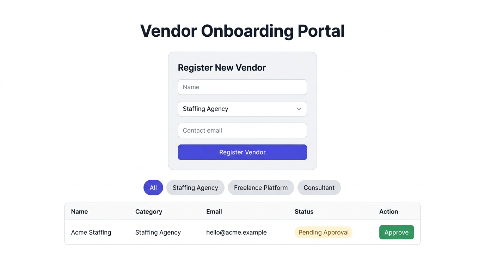

# Vendor Onboarding Portal

React + TypeScript (Vite) frontend and FastAPI backend with in-memory vendor storage.

## Run locally

**Backend** (terminal 1):

```bash
cd backend
python -m venv .venv
.venv\Scripts\activate
pip install -r requirements.txt
uvicorn main:app --reload --port 8000
```

Open http://localhost:8000/docs for the API.

**Frontend** (terminal 2):

```bash
cd frontend
npm install
npm run dev
```

Open http://localhost:5173 — ensure the backend is running on port 8000.

## Testing

### Automated (pytest)

From the `backend` folder (with dependencies installed):

```bash
cd backend
pip install -r requirements.txt
python -m pytest tests -v
```

These exercise the same routes as the interactive docs: empty list, create vendor with **Pending Approval**, approve, 404 for bad id, and a check that `/openapi.json` exposes the API (what Swagger UI uses).

### Manual — Swagger UI

1. Start the backend (`uvicorn main:app --reload --port 8000`).
2. Open **http://localhost:8000/docs** — you’ll see **Swagger UI** with `POST /vendors`, `GET /vendors`, and `PATCH /vendors/{vendor_id}/approve`.
3. Use **Try it out** on each endpoint: create a vendor, **Execute**, then **GET** to list, then **PATCH** … `/approve` with that vendor’s `id`.

Alternative OpenAPI viewers: **http://localhost:8000/redoc** (ReDoc).

### Frontend + API together

With backend on port **8000** and `npm run dev` on **5173**, use the form and table in the browser; the UI talks to the same API you exercise in Swagger.

## UI layout (what you’ll see)



- **Title:** “Vendor Onboarding Portal” at the top.
- **Register New Vendor:** Light gray card (`#f9f9f9`) with fields **Name**, **Category** (dropdown: Staffing Agency, Freelance Platform, Consultant), **Contact Email**, red validation messages if needed, and an indigo **Register Vendor** button (`#4f46e5`).
- **Filters:** Pill buttons — **All** plus the three categories; active filter is indigo, others gray.
- **Table:** Columns **Name**, **Category**, **Email**, **Status**, **Action**. Status is a pill: yellow/cream (`#fef9c3` / `#78350f`) for **Pending Approval**, green (`#d1fae5` / `#065f46`) for **Approved**. **Approve** (green button) appears only while status is not Approved.

## Features

- `POST /vendors` — register a vendor (default status: Pending Approval)
- `GET /vendors` — list vendors
- `PATCH /vendors/{id}/approve` — approve a vendor
- UI: form validation, category filters, approve action

---

## Prompts used

### 1. Planning (Claude Sonnet 4.6)

First pass was only the plan: stack, file layout, and build order so the actual coding stayed linear.

```
Teckleap round 2 is a vendor onboarding portal—React + TypeScript on the front,
FastAPI on the back, in-memory store (no DB). This is a 30-minute assignment.

Give me a tight build plan: folder structure, the three endpoints I actually need,
default vendor status, CORS note, and the exact Vite/React steps. Include a hard
step to wipe both src/index.css and src/App.css to empty before building the UI (not
just a vague “gotcha”). Order the steps so backend comes before UI.

Bonus checklist—name these three explicitly so nothing gets missed: (1) filter vendors
by category, (2) Approve button per row, (3) form validation for empty fields and email
format.
```

### 2. Implementation

What we used to implement against a local `plan.md` and problem-statement PDF (git and README were added afterward, not in this prompt). Those files are not part of this repository.

```
Read plan.md and the problem statement PDF in plan/. Scaffold FastAPI: POST /vendors,
GET /vendors, PATCH /vendors/{id}/approve; in-memory list; default new vendor status
"Pending Approval"; CORS for local dev.

Vite + React + TypeScript: before you write UI code, wipe src/index.css and
src/App.css completely (empty files). API base URL http://localhost:8000.

TypeScript Vendor type must match the API: id, name, category, contact_email, status.

Table columns in order: Name, Category, Email, Status, Action. Status badges: if
Approved use background #d1fae5 and text #065f46; otherwise (e.g. Pending Approval)
background #fef9c3 and text #78350f. Approve button only when status is not Approved;
hide it once approved.

Form: name, category (dropdown: Staffing Agency, Freelance Platform, Consultant),
contact email; reload the list after a successful POST. Category filter chips: All
plus those three categories.

Do not add git, do not add a README yet.
```

The first prompt matches the spec timebox and locks the three bonuses plus the CSS wipe. The second prompt fixes paths, removes repo push from the build step so the agent does not stall, pins the UI contract, and defers git/README until you choose.
